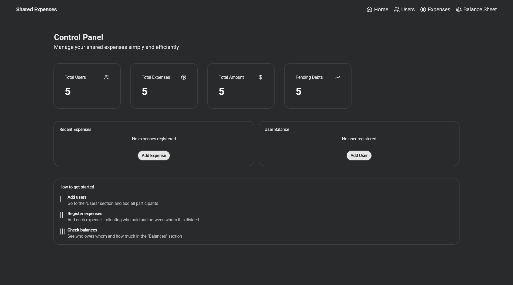

# Shared Expense Management System
> 🚧 Work in progress — UI subject to change
Minimal expense tracker to manage users and shared expenses with a clean dark interface.

🔗 **[Live Demo](https://shared-expense-management-system.tahianawanda.workers.dev/)**

---
## Tech Stack
- React + TypeScript
- Styled Components
- Vite
## Getting Started
bash
# Install dependencies
npm install
# Start dev server
npm run dev

## Roadmap
- [x] User management (add, edit, delete)
- [ ] Expense tracking
- [ ] Expense splitting between users
- [ ] Backend integration